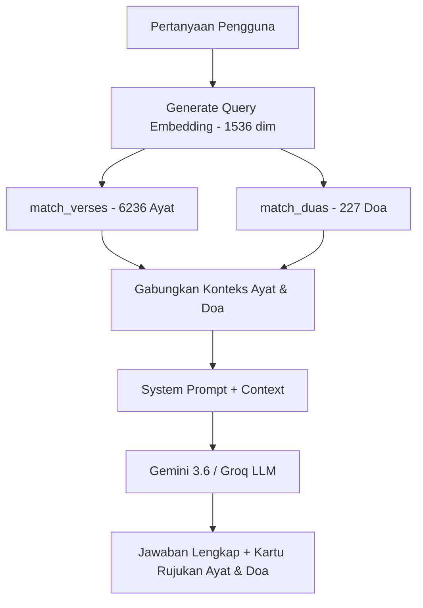

# Vectorisasi Doa & Integrasi RAG Doa ke EQuran AI

Menambahkan tabel `duas` ke Supabase, men-generate vector embeddings (1536 dimensi via Gemini Embedding / OpenAI) untuk seluruh koleksi ~227 doa dari API `equran.id`, dan mengintegrasikan vector search doa secara paralel dengan ayat Al-Qur'an pada AI Assistant (`EQuran AI`).

## Arsitektur RAG Paralel (Ayat + Doa)



---

## User Review Required

> [!IMPORTANT]
> **Langkah Eksekusi SQL di Supabase**:
> Karena REST API Supabase (anon key) tidak mengizinkan DDL langsung untuk membuat tabel baru dan fungsi RPC, file SQL `supabase_duas_schema.sql` perlu di-copy & paste ke **Supabase SQL Editor** dan di-Run sekali sebelum script seed dijalankan.
> Kami akan menyediakan file SQL lengkap yang siap tinggal di-copy paste.

> [!NOTE]
> **Embedding Provider**:
> Hasil pengujian menunjukkan bahwa OpenAI API key saat ini memiliki status *quota exhausted* (`credit_balance_exhausted`), sedangkan Google Gemini (`gemini-embedding-001` dengan `outputDimensionality: 1536`) terbukti aktif, gratis, dan memiliki similarity score tinggi (>0.82) pada database Supabase. Oleh karena itu, kita akan menjadikan **Gemini Embedding (1536 dim)** sebagai primary embedder dengan OpenAI sebagai secondary fallback.

---

## Proposed Changes

### 1. Database Schema

#### [NEW] [`supabase_duas_schema.sql`](file:///e:/coding/ai-quran-web/supabase_duas_schema.sql)
File script SQL lengkap untuk dijalankan di Supabase SQL Editor:
- Membuat tabel `public.duas` (`id`, `dua_id`, `grup`, `nama`, `arabic_text`, `transliteration`, `translation`, `tentang`, `tags`, `embedding VECTOR(1536)`, `created_at`).
- Row Level Security (RLS) & Policies (`SELECT` dan `INSERT/UPDATE` publik).
- HNSW Index (`duas_embedding_hnsw_idx`) untuk similarity search cepat berbasis cosine distance.
- RPC Function `match_duas(query_embedding VECTOR(1536), match_threshold FLOAT, match_count INT)`.

---

### 2. Seed & Ingest Script

#### [NEW] [`scripts/seed_duas.js`](file:///e:/coding/ai-quran-web/scripts/seed_duas.js)
Script otomatisasi Node.js:
- Fetch semua 227 doa dari `https://equran.id/api/doa`.
- Ekstrak teks semantik untuk embedding:
  `Judul: {nama}\nKategori: {grup}\nTerjemahan: {idn}\nKeterangan: {tentang}\nTag: {tag}`
- Generate vector embeddings 1536-dim menggunakan Gemini `gemini-embedding-001` (dengan fallback OpenAI).
- Upsert doa beserta vector embedding ke tabel `duas` di Supabase.
- Melakukan verifikasi otomatis di akhir script dengan mengetes query vector search (cth: *"doa sebelum makan"*, *"doa memohon ketenangan dan kesabaran"*).

#### [MODIFY] [`package.json`](file:///e:/coding/ai-quran-web/package.json)
- Tambah script npm: `"seed:duas": "node scripts/seed_duas.js"`.

---

### 3. Backend & Services Update

#### [MODIFY] [`src/services/supabase.ts`](file:///e:/coding/ai-quran-web/src/services/supabase.ts)
- Tambah interface `DuaSearchResult`:
  ```ts
  export interface DuaSearchResult {
    id: number;
    dua_id: number;
    grup: string;
    nama: string;
    arabic_text: string;
    transliteration?: string;
    translation: string;
    tentang?: string;
    similarity: number;
  }
  ```
- Tambah fungsi `searchDuas(queryEmbedding: number[], matchThreshold = 0.55, matchCount = 3)`.

#### [MODIFY] [`src/app/api/ai/route.ts`](file:///e:/coding/ai-quran-web/src/app/api/ai/route.ts)
- Perbarui fungsi `generateEmbedding()` agar menggunakan **Google Gemini `gemini-embedding-001` (1536 dim)** sebagai primary, dengan fallback ke OpenAI jika Gemini offline.
- Jalankan pencarian vektor secara paralel:
  ```ts
  const [verseResults, duaResults] = await Promise.all([
    searchVerses(embedding, 0.55, 3),
    searchDuas(embedding, 0.55, 3),
  ]);
  ```
- Format konteks RAG yang kaya berisi `REFERENSI AYAT AL-QUR'AN:` dan `REFERENSI DOA & HADITS:`.
- Perbarui System Prompt agar AI Assistant dapat merujuk ayat dan doa secara harmonis dan relevan.
- Kirim daftar `duaCitations` dalam JSON response.

#### [MODIFY] [`src/services/aiService.ts`](file:///e:/coding/ai-quran-web/src/services/aiService.ts)
- Tambah tipe `AIDuaCitation`:
  ```ts
  export interface AIDuaCitation {
    duaId: number;
    title: string;
    group: string;
    arabicText?: string;
    translation?: string;
    source?: string;
  }
  ```
- Update `AIResponse` untuk menyertakan `duaCitations?: AIDuaCitation[]`.

---

### 4. Frontend UI Components

#### [NEW] [`src/components/ai/DuaCitationCard.tsx`](file:///e:/coding/ai-quran-web/src/components/ai/DuaCitationCard.tsx)
- Kartu referensi doa yang elegan bergaya emerald & gold:
  - Ikon lentera / doa islami.
  - Judul doa dan grup kategori.
  - Teks Arab berharakat.
  - Terjemahan dan sumber hadits (`tentang`).
  - Tombol aksi salin doa.

#### [MODIFY] [`src/components/ai/ChatBubble.tsx`](file:///e:/coding/ai-quran-web/src/components/ai/ChatBubble.tsx)
- Terima prop `duaCitations?: AIDuaCitation[]`.
- Render section *"Rujukan Doa Harian & Hadits:"* dengan `DuaCitationCard` di bawah rujukan ayat jika ada doa yang relevan.

#### [MODIFY] [`src/stores/useChatStore.ts`](file:///e:/coding/ai-quran-web/src/stores/useChatStore.ts)
- Tambah field `duaCitations?: AIDuaCitation[]` pada `ChatMessageItem`.

---

## Verification Plan

### Automated Tests
1. **Seed & Ingestion Test**:
   - Jalankan `node scripts/seed_duas.js` dan pastikan seluruh 227 doa berhasil di-generate embedding-nya dan tersimpan di Supabase.
   - Script akan otomatis mengeksekusi test vector similarity query pada `match_duas`.
2. **API Endpoint Test**:
   - Panggil endpoint `/api/ai` dengan query pertanyaan doa (cth: *"doa sebelum tidur"*, *"bagaimana doa agar diberi kemudahan urusan"*).
   - Verifikasi bahwa respons menyertakan teks penjelasan, `citations` (ayat), dan `duaCitations` (doa).

### Manual Verification
1. Buka browser pada halaman AI Chat (`/app/ai-chat`).
2. Tanyakan: *"Tuliskan doa sebelum makan beserta artinya"*.
   - Verifikasi jawaban AI menyajikan doa yang akurat.
   - Verifikasi muncul kartu `DuaCitationCard` yang rapi dan dapat disalin.
3. Tanyakan: *"Saya sedang gelisah dan menghadapi ujian berat, adakah ayat dan doa yang bisa diamalkan?"*.
   - Verifikasi muncul rujukan ayat Al-Qur'an (QS. Al-Baqarah/Al-Insyirah) DAN rujukan doa ketenangan hati secara bersamaan.
